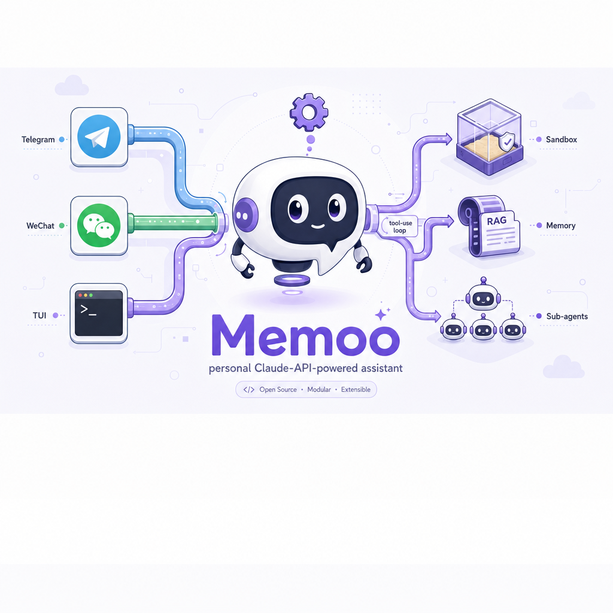

# Memoo

Lightweight personal AI agent bot built on Claude API `tool_use` with OpenAI fallback. A single `Agent` class orchestrates perception–decision–action–reflection cycles, and all messaging platforms flow through one central `handle_message()` entry point.

**macOS and Linux** — code execution sandboxing uses `sandbox-exec` on macOS (built-in) or `bubblewrap` on Linux (`apt install bubblewrap` / `dnf install bubblewrap`). Windows is not supported.

## Features

- **Agentic loop** — LLM → tool calls → hooks → execute → repeat, with parallel tool dispatch via `asyncio.gather`
- **Multi-provider LLM** — Anthropic (primary) and OpenAI, with automatic fallback chain and runtime model hot-switching (`/model`)
- **Hybrid RAG memory** — Two-tier SQLite: active messages + archive with three-signal ranking (embedding similarity + FTS5 keyword + importance score)
- **Dream cycle** — Periodic memory consolidation via LLM, with Anthropic Batch API support (50% cost)
- **Skills system** — Three-level progressive disclosure (metadata → instructions → resources), auto-discovered from `skills/` directory
- **Sub-agent spawning** — Depth-limited child agents with per-provider model selection, context modes, and sandbox flags
- **Per-session sandbox** — OS-level isolation: macOS `sandbox-exec` with custom SBPL profiles, or Linux `bubblewrap` with namespace isolation. Auto-detected at startup.
- **Slash commands** — `/help`, `/clear`, `/config`, `/model`, `/status`, `/new`, `/compact`, and skill triggers
- **Cron scheduler** — 5-field cron expressions with SQLite persistence
- **Heartbeat tasks** — Periodic tasks defined as markdown files with YAML frontmatter
- **Gateway** — JSON-over-TCP server with token auth, optional mTLS, and streaming events
- **Crash boundary** — Structured crash reports, webhook alerts, and autofix queue

## Channels

| Channel  | Description |
|----------|-------------|
| Telegram | Polling mode with bind-code auth and allowlist |
| WeChat   | Via iLink adapter |
| TUI      | Terminal UI fallback with `prompt-toolkit` |

## Quick Start

```bash
# Clone
git clone https://github.com/StevenLi-phoenix/Memoo.git
cd Memoo

# Install (requires Python 3.12+ and uv)
uv sync

# Configure
cp config.yaml.example config.yaml  # or edit config.yaml directly
# Add API keys to .env:
#   ANTHROPIC_API_KEY=...
#   TELEGRAM_BOT_TOKEN=...  (optional)

# Run
source .venv/bin/activate
python main.py
```

## Configuration

All settings live in `config.yaml`, mirrored by the `AppConfig` dataclass in `core/config.py`. The agent can read and modify config at runtime — changes persist back to YAML.

Key sections: `llm` (providers, fallback, model cache), `agent` (system prompt, tool rounds, context window), `memory` (DB path, context limits), `embedding` (local/openai/off), `channels` (telegram, wechat), `tools` (toggle capabilities), `sandbox` (timeout, output limits).

API keys are loaded from `.env` via `python-dotenv`.

## Development

```bash
# Install dev dependencies
uv sync --extra dev

# Lint & format
ruff check .
ruff format .

# Run tests
pytest                              # all tests
pytest tests/test_foo.py            # single file
pytest tests/test_foo.py::test_bar  # single test
```

## Architecture

```
main.py            ─── orchestrates everything
├── models/            LLM providers (Anthropic, OpenAI) via Protocol + factory
├── core/
│   ├── agent.py       Agentic loop
│   ├── memory.py      Two-tier SQLite + hybrid RAG
│   ├── tools.py       ToolRegistry with auto-schema from docstrings
│   ├── hooks.py       Pre-execution guards
│   ├── commands.py    Slash command router
│   ├── embeddings.py  Pluggable embedding providers
│   ├── dream.py       Memory consolidation
│   ├── scheduler.py   Cron-based task scheduler
│   ├── heartbeat.py   Periodic markdown tasks
│   ├── gateway.py     JSON-over-TCP streaming server
│   ├── config.py      AppConfig dataclass
│   ├── skills.py      Progressive skill disclosure
│   ├── sandbox.py     macOS sandbox-exec / Linux bubblewrap (auto-detected)
│   └── crash.py       Crash reports + autofix
├── channels/          Telegram, WeChat, TUI
├── tools/             Auto-discovered tool modules
├── skills/            Modular agent capabilities
├── heartbeat/         Task definitions (markdown + YAML)
├── memory/            Dream output (MEMORY.md, USER.md)
└── systemprompt/      System prompt files
```

## Extending

- **New tool** — Create `tools/my_tool.py` with `register(registry, **deps)`. Use `@registry.tool` — schema auto-generates from type hints and docstrings.
- **New channel** — Implement the `Channel` Protocol (`start`, `send`, `stop`), register in `channels/__init__.py`.
- **New LLM provider** — Implement the `LLMProvider` Protocol, register in `models/__init__.py`.
- **New skill** — Create `skills/my_skill/SKILL.md` with YAML frontmatter. Auto-discovered at startup.
- **New heartbeat** — Create `heartbeat/my_task.md` with YAML frontmatter (`name`, `interval`, `enabled`).

## License

MIT
